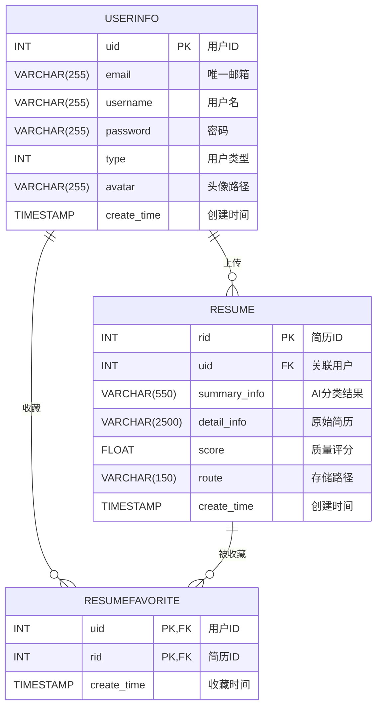

```mermaid
erDiagram
    USERINFO ||--o{ RESUME : "上传"
    USERINFO ||--o{ RESUMEFAVORITE : "收藏"
    RESUME ||--o{ RESUMEFAVORITE : "被收藏"

    USERINFO {
        INT uid PK "用户ID"
        VARCHAR(255) email "唯一邮箱"
        VARCHAR(255) username "用户名"
        VARCHAR(255) password "密码"
        INT type "用户类型"
        VARCHAR(255) avatar "头像路径"
        TIMESTAMP create_time "创建时间"
    }

    RESUME {
        INT rid PK "简历ID"
        INT uid FK "关联用户"
        VARCHAR(550) summary_info "AI分类结果"
        VARCHAR(2500) detail_info "原始简历"
        FLOAT score "质量评分"
        VARCHAR(150) route "存储路径"
        TIMESTAMP create_time "创建时间"
    }

    RESUMEFAVORITE {
        INT uid PK,FK "用户ID"
        INT rid PK,FK "简历ID"
        TIMESTAMP create_time "收藏时间"
    }

```